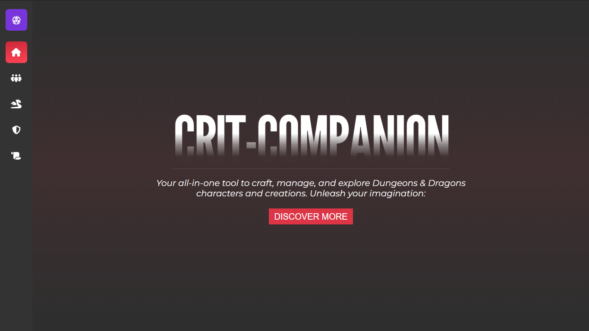
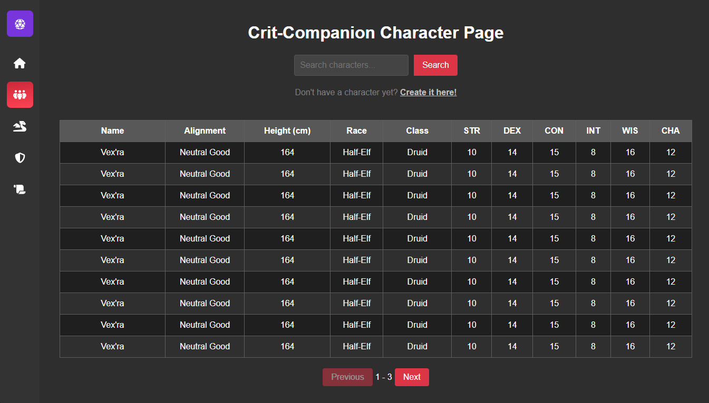
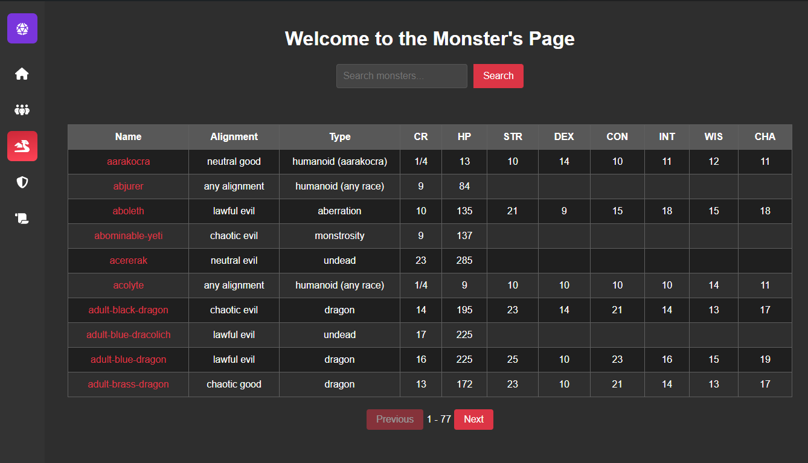
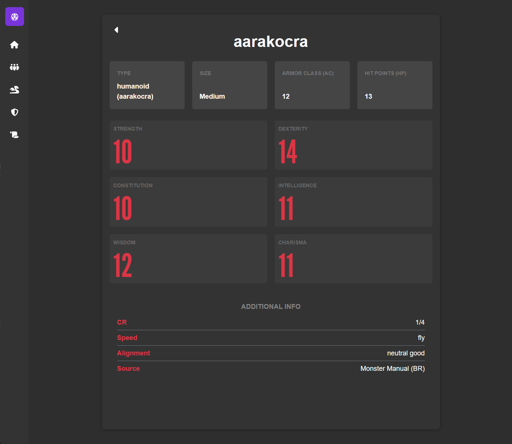

# crit-companion

**Crit Companion** is a Dungeons & Dragons (DnD) companion app that helps you manage your adventures. Whether you're a player or a Dungeon Master, this app provides tools to:

- Create and manage your DnD characters.
- Search and view details for monsters from a comprehensive DnD monster database.
- (Future Feature) Plan and manage encounters, track health, damage, and initiative.

**Image:** 

---

## Dependencies

Ensure your system has the following dependencies (or that they exist in `$PATH`):

| Name | Description | Link |
|------|-------------|------|
| Deno | A modern runtime for JavaScript and TypeScript. | [Visit Deno](https://deno.land/) |
| Bun  | A fast JavaScript runtime and package manager. | [Visit Bun](https://bun.sh/) |

Additionally, install the prerequisites for your operating system as described on the [Tauri prerequisites page](https://tauri.app/start/prerequisites/).

---

## Getting Started

1. Clone the repository and navigate to the project folder:
   ```bash
   git clone https://github.com/your-repo/crit-companion.git
   cd crit-companion
   ```

2. Install the dependencies:
   ```bash
   npm install
   ```

3. Initialize Tauri for Android development:
   ```bash
   npm run tauri android init
   ```

### Running the App

- **For Desktop Development:**
  ```bash
  npm run tauri dev
  ```

- **For Android Development:**
  ```bash
  npm run tauri android dev
  ```

---

## Features

### Character Management
- Create and manage DnD characters.
- Search for characters in a list that displays all created characters.
- View detailed information about any character.

**Image:** 

### Monster Database
- Browse and search a comprehensive list of DnD monsters.
- View detailed stats and information for each monster.

**Image:** 

**Image:** 


### (Future Feature) Encounter Management
- Plan and manage encounters.
- Add players and monsters to an encounter.
- Track initiative, health, and damage during combat.

---

## Future Development

- **Encounters Page:**
  - Create encounters by selecting players and monsters.
  - Track HP, damage, initiative, and other combat stats during gameplay.

- **Improved Character Features:**
  - Enhanced character creation options.
  - Export and import characters.

- **Additional Monster Filters:**
  - Filter monsters by attributes such as challenge rating, type, or environment.

---

## Feedback and Contributions

We welcome feedback and contributions! Feel free to open an issue or submit a pull request on GitHub.

---

## License

This project is licensed under [LICENSE_NAME]. See the `LICENSE` file for details.
